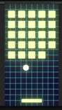

# Design Journal

## Breaking Out ~ 13/02/25
For this week, I wanted to try making a look and feel prototype. I was inspired by the work I saw from my peers last week and wanted to try having a neon retro sort of look. I looked up a tutorial on Youtube to achieve the glow and made a simple background image. The idea I had was making the bricks be squares like pixels and then for next week, adding levels where the bricks make some sort of simple pixel art. Also as I'm typing this I just had the idea to make this game about pimple popping cause the title sort of sounds like an acne breakout. That would have been funny to explore but oh well I got that idea too late. I also thought of switching the game screen to be vertical as that might put more distance between the paddle, ball and the bricks and I felt it made sense for a game that has a lot of..vertical action? I wanted to add more UI elements like finishing up the lives and scoring system that was already sort of started, adding more audio, background music and a start/game over screen, but I ran out of time. Since we have the option to build upon this prototype for next week's prototype, I'll try to get that done for next week! Overall, I like the way the game looks and it was fun experimenting with the look of the game. 

## Pawng ~ 06/02/25
Once again I didn't have much time to work on the prototype but at least I have something to show this time. :) I thought it might be interesting to have the paddle sizes change over time, maybe having your opponent's paddle become smaller when you score a point to give you an extra reward. The same being true that your opponent could score and make your paddle smaller. (Though the issue I see here could be that players with a head start on the score have a much easier time winning the entire game, but I didn't really care about game balance and fun this week, I just wanted to try stuff out). To be honest, I wasn't sure how to achieve this so I did a bit of researching online. I found a useful [Youtube video series](https://www.youtube.com/watch?v=DnBTmYXThOY&list=PLEl7CIZGv53xhngxJdS_GAaSXpXcN-hSP) where they make a fancy Pong in Unity. Though looking at it quickly, I wasn't able to find what I needed so I have to admit that I did resort to using ChatGPT, at least for the beginning (I hope that's okay). Then, I got the idea of giving the player who scores an even bigger advantage and making their paddle bigger when they score as well. I also incorporated this to make sure I really understood the code that ChatGPT gave me and use what I learned in a slighyly different way. Next, I wanted to use the Youtube videos I mentionned earlier to make an ending screen whenever a player gets a total of 5 points. I did a bit of coding for it, but the example in the video was a bit more complicated as they were returning to a main menu screen they had previously made, once a player won. I tried simplifying it by having some simple text appear on screen whenever a player won, but I was having issues with having the text show up so I kind of gave up, mostly due to lack of time. I also added a score noise. I swear I had a good score sound already on my PC but I couldn't find it so I opted for something goofy. The sound also plays at the beginning of the game for some reason and I wasn't able to figure out why. So that's pretty much what I accomplished this week. If I had more time, I would have finished the player winner stuff and incorporated some of the stuff from the Youtube videos like visual effects and UI improvements. Maybe added more color to the game too. Gameplay-wise I did wonder if it would be interesting to have some sort of power ups you can collect that are sort of like the ball object and you have to catch them to receive some sort of power up like improved speed. But also that sounds complicated to do so I don't even know if I could have made that happen.

## Collision ~ 20/01/25
In the end, this week I didn't have much time to work on a prototype, so I focused on experimenting and playing around with Unity and what we learned in class last week. I don't really have anything to show for it because I ran into issues. I wanted to try collision with the example that we coded in the Chapter 20 of IGDPAD (where we make a bunch of colorful cubes spawn over and over) but I wanted to try making it with circles instead, but I had issues recreating the spawner for some reason. What would happen was the circle would fall, but others wouldn't spawn. I probably should have just opened the book again at that chapter to review how it was done but I wanted to try it myself to see if I can remember how to do it (clearly not). I though it would have been interesting to have a bunch of circle spawn and collide with each other as they filled out a closed space (like a rectangle). Though like I said earlier, due to lack of time, in the end I mostly did some explorations and experiments within Unity. If I had more time, maybe I would have played around different shapes and spawn rates.

## Tiny Game ~ 23/01/25 

[Project for class today](Projects/Week1/chrysalis.html)

After trying out the Bitsy games that were linked in the class website, I was impressed by the tool so I wanted to give it a try for this week’s game. I came up with two core mechanics I thought would be interesting to explore.

1- Telling a story through simple repetitive motions of the avatar, sort of like [this game](https://npckc.itch.io/you-are-dough) where you simply move the dough along as it gets turned into bread and get little bits of dialogue that progress the game. I thought of telling a story by having players control the movements of the sun and moon and thus controlling the flow of time. I was also inspired by the game Faith and a personal experience of looping nightmares, and so I thought of maybe making a small pixel horror game with an unending nightmare loop. I didn’t go through with this idea in the end because of the two ideas I had, this seemed the hardest to pull off with Bitsy (especially visually as I imagined it in a similar style to that of Faith’s).

2- Exploring your environment and surroundings and making sense of it. Each room of the game is like a puzzle piece where you must explore all the rooms to make sense of where you are and figure out the shape of the world. I imagined playing the game in the perspective of an insect so that it could be on smaller, more recognizable (to us at least) objects like flowers, leafs, etc. 

<!--  -->
<!-- [this is a link](https://www...) -->

Like I mentioned before, I went with the second idea for this prototype because it seemed more achievable. I decided on having players control an anxious, shut-in caterpillar as it explores the big world after being forced out of its home (a leaf) after eating it all. Players explore each room of every level (which are separated by different color palettes) to make sense of the environment they’re in. Pieces of caterpillar food are scattered along the rooms to to progress the dialogue/story, but also to guide the player towards certain directions. Once they reach the last room, they are asked what it is they’ve been exploring thus far. Once they make the right decision, they move onto the next level.

I made this in a few hours, but if I had more time for it, I would have improved the visuals and the puzzles (as in, make more rooms for each level and more complex levels). Originally, I thought it would be visually interesting if the smaller tiles of the game formed a bigger visual together, not just for the big “puzzle” pieces of the environment, but for background elements as well. As seen in my sketches, for example in the flower level, I wanted to have other flowers visible in the background. So if I were to improve on this later, I would add more interesting visuals. I maybe would have played around more with Bitsy’s sound tools to make a little song. While I enjoyed using this tool to make my tiny game, it was also frustrating because it would visually bug often and I’d have to refresh my page a lot, so I didn’t feel like making anything too long and complicated (which I guess is fine cause the point was to make a tiny game/prototype).

After doing the class playtest, most people seemed to enjoy the theme and found the game cute and enjoyed the concept of figuring out what your environment is. Like I expected, because there is only one tile for each exit in Bitsy, it led to confusion on which specific tile in the map leads to the next room.

