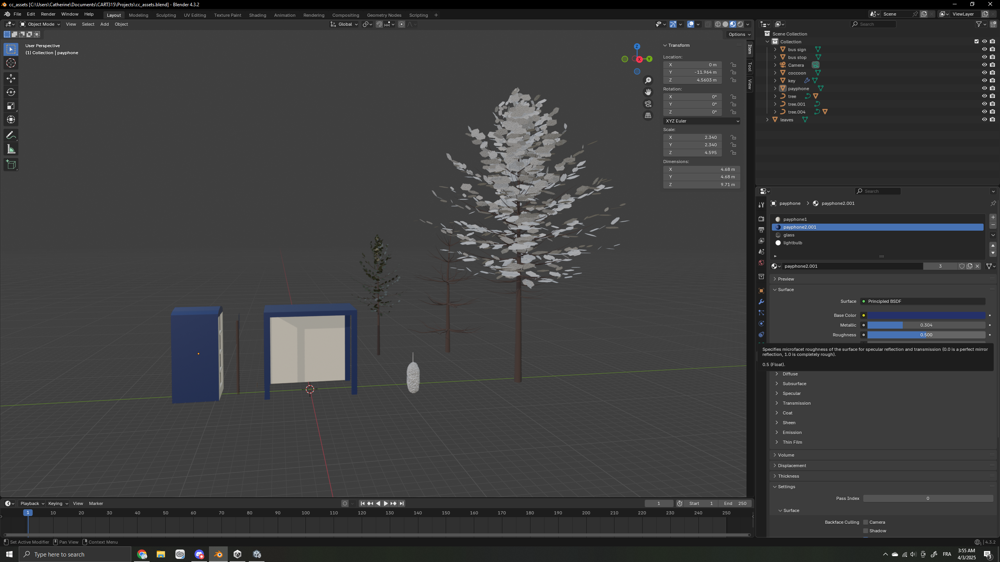
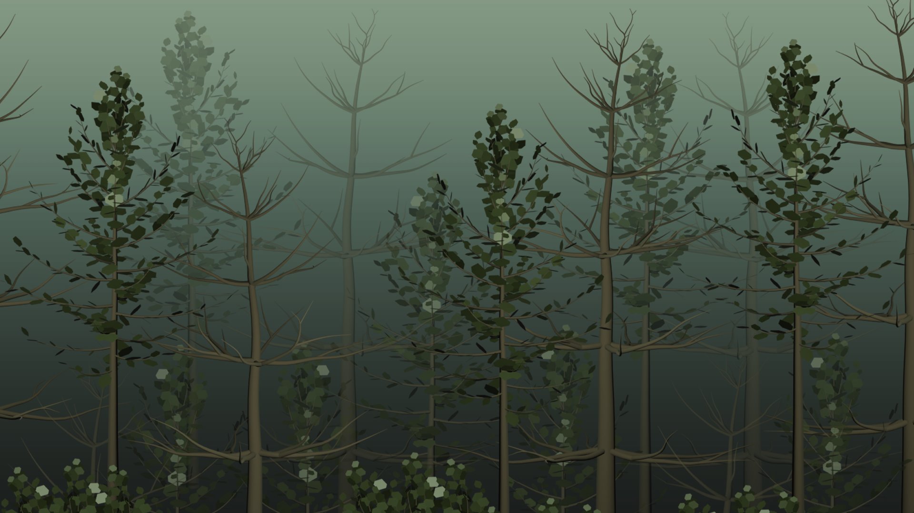
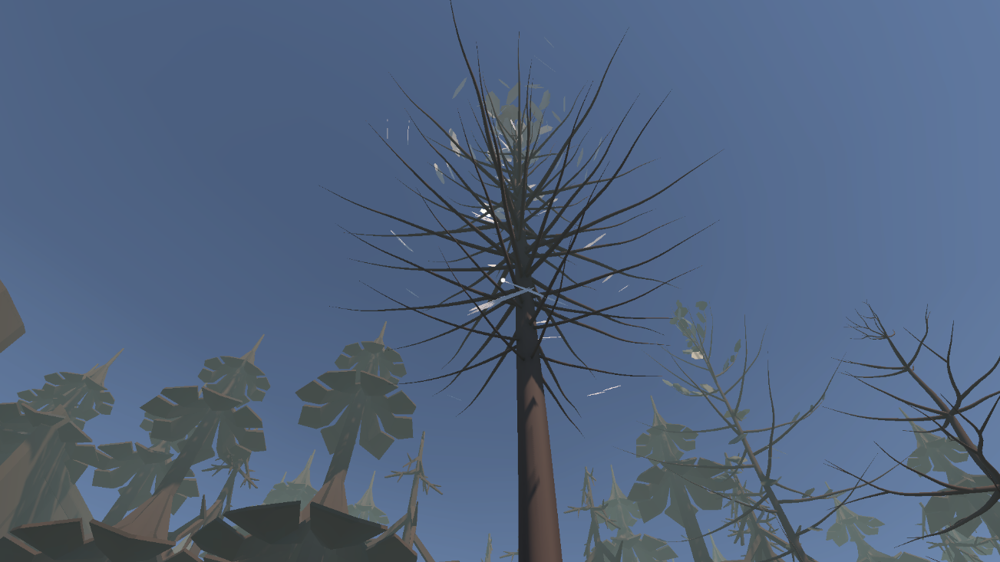
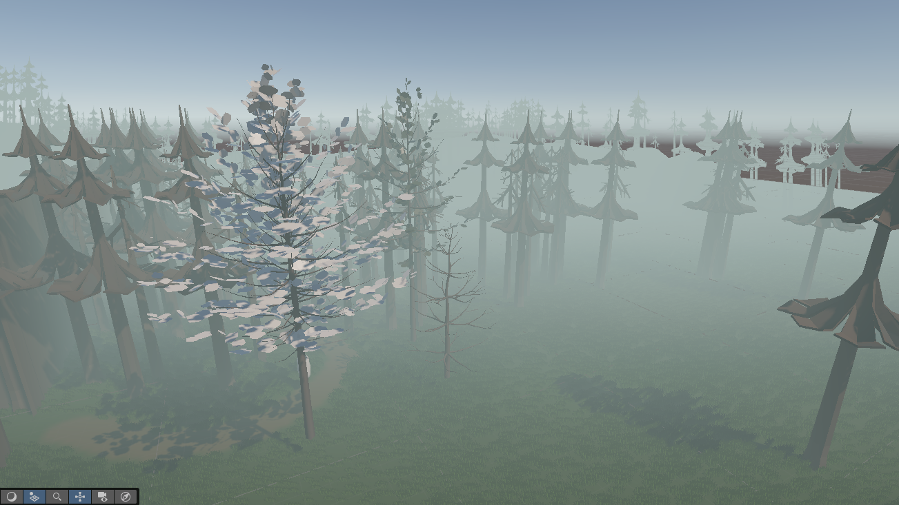

# Design Journal

## Iterative Prototype 6 ~ 17/04/25
Goals for the final iteration:
1- Create the simple inventory system and make it possible to solve the first puzzle
2- Re-export Blender assets to fix issue from last week
3- Improve the visuals of the environment (trees, tree walls, "monster")
4- Create some creep factor (with the monster)
5- Add pixel shader?

Goal 1
I completed this goal last week thanks to a tutorial I found online but I forgot to save it and now I can't find it anymore!! But thankfully it wasn't as hard to do as it seemed and I'm really happy with how it looks and that I managed to create what I had been imagining for the inventory system which is having the held item shown as an icon on the main screen. I could have worked on this some more to make it possible to place items in the world (which would have made it possible to complete my initial version of this puzzle because you had to find a ladder and place it so you can climb it) but since there wasn't much time left and I had much I wanted to do, I decided to simplify the first puzzle to just finding the key and using it to open the locked fence. It does unfortunately make the game duller and focus more on exploration instead of solving an actual puzzle... Also I could have had something happen when you reach the telephone booth as a reward but again due to lack of time I kept it as is. So once you solve the puzzle nothing really happens...

Goal 2
I know I said last time that I would not focus on fixing the trees I made due to lack of time, but at least for the spider web trees I thought it was such a shame that they look weird in Unity, since I wanted to have the look of the "spider web" leafs covering the sky and creating that sort of environment. After having similar issues when exporting Blender assets to UE5 for another project and figuring out the issue, I thought maybe the same solution would work for this project and it did! I just had to recalculate the normals and re-export the model and everything was as it should be, so I ended up creating the little spider web forest area into the project and hid the key inside that area behind a tree.

Goal 3
One of my subgoals here was to replace the trees I used in the Unity asset pack with the trees I had made myself. It was quite simple to do in theory (or so I thought) since I just had to use Unity's terrain paint trees and mass place trees tool to replace the placeholder trees. When adding the trees to my "brush" though, they seem to be sideways for some reason, which is strange because when I pull in the raw model into my environment it is in the right orientation. And I think because they're sideways, even if I try to place them on my scene with the brush tool, nothing seems to happen. Because of that I unfortunately gave up on the idea of replacing the placeholder trees by the trees I made...and since that was the case I had to change the asset I made for the "tree wall" since I had been using a image texture for it that I made with my tree models. I had to change it so that it is a wall of the placeholder trees from my project, so I took a screenshot of some trees in my scene and used that as a material on a 3D model of a wall and imported it into Unity to replace the huge fence assets I had been using as a placeholder for the walls. One of my original ideas for the wall was not just to limit the player in where they can go and keep the hidden path...hidden, but also because I thought it would be cool to have the image texture randomly change into something creepy like eyes staring at you. Once again, this is something I didn't have the time to complete but really wish I could do. Something small I changed as well was adding a road and cobblestone material in some parts of the road (that I got from the asset store) and make the fog more intense and I feel it adds more mystery.

Goal 4
I had the idea last time to have like a wall of monsters coming towards you as you approach them to hopefully still scare the player into running back and finding the hidden path. Though in the end I didn't have time to do something simple like that either... I wanted to make my own monster model but ended up using one from the asset pack I had and made a static monster "wall" with it. I guess it sort of is creepy...? But everything is so static.. I wish I could have added other creepy elements like sounds, it would make the world seem more alive as well.

Goal 5
This was low on my priority however I found [a very quick and easy tutorial](https://www.youtube.com/watch?v=Sru8XDwxC3I) and decided to try it out. I like the look of it with the pixel shader! I feel with that and the extra fog that it adds more mystery and confusion to the project which helps with the creepyness.

Considering we agreed on me doing a vertical slice of my original idea, I'm quite disappointed with what I've managed to get done and I don't believe it to be a true vertical slice. I'd consider this final iteration to overall be a mid fidelity prototype since some of the visuals are refined but some are still placeholders, and I unfortunately had to cut out a lot from my original idea for this game. As it is, I don't know if it accomplishes the goal I had of having a game initially seeming to be a horror game and then slowly becoming a calm exploration puzzle game. I do wonder what it would have been like to try to make this game in 2D instead and if it would have been simpler for me to make it that way (also since I am more comfortable with making 2D images and I guess games too and since one struggle I had with this project was with correctly importing my Blender assets into Unity...it was kind of a headache). However, the 3D aspect of it does afford the player more exploration than if I had done it in 2D, which would have been more limiting in that aspect. Despite the overall disappointment I feel for this project, as a first 3D project in Unity (and first 3D environment) I'm decently satisfied with it (at least as an exploration of what I can do in Unity).

## Iterative Prototype 5 ~ 03/03/25
Goals for this week:
1- Finally manage to make the simple interaction system
2- Make some assets of my own and start adding them to the project
3- Improve some of the visuals (testing out pixel shader, changing the skybox)

Goal 1
First thing I did for this week's prototype was finish the simple interaction system I tried making last week using the other video tutorial I found. Although the video was going super quickly with lots of information, I did manage to achieve this goal. Interactable items are attached with a script that describes what happens once they're interacted with (for now they get destroyed) and that contains the "pick up" message that appears when the player gets close to an interactable item. There is another script attached to the player capsule that makes it so that the "pick up" message only displays once the player comes at a certain distance to the object and is directly looking at it, which is done thanks to a ray. For now, the object gets destroyed when the player presses E on it, but for next week I'd like to have some form of inventory system where there would be an icon of the object shown at the bottom right once its picked up.

Goal 2
I tried not spending too much time on the assets and just making something quick, but it was surprisingly harder than it seemed. The style is still very low poly and simple though. There are a few assets I have left to do that I left for later like the monster, while other assets that are missing because I'll just use something from the asset store (like the bus, or a road texture). For importing my assets into Unity, I followed a tutorial to do this just to make sure I'm doing everything correctly, and while I was attempting to import a single asset into my project, for some reason all my assets were already included...which I THINK is ok? Idk I don't see a problem with it but it certainly wasn't what I was intending to do. The only problem I've noticed is that some of the materials or meshes look different in Unity than in Blender for some reason. I've attached some screenshots below, but other examples are my bus sign not having the sign part, it's just a pole in the ground in Unity...my bus stop was also missing a few faces. I'm not sure if I exported them from Blender incorrectly, but frankly I am so tired right now it is 4am and don't feel like spending forever on this so I'll likely do it tomorrow evening during class time...maybe.

Goal 3
Like I said I stopped somewhere in goal 2, but I did look into pixel shader tutorials and found some that seemed interesting. I'm not yet sure if I'll commit to that look yet, and I just wanted to experiment. For the skybox, it is definitely a change I'm going to make so I can switch the scene to a night scene, but I'll do that for next week...

So it seems like there's a lot to do for next week. By order of priority, I should make the inventory system first, then finish adding all the assets in the scene (and at least changing the skybox while I'm at it). Next, I'll make my puzzle solvable by being able to use the ladder to get the key and then the key to unlock the gate to the payphone. After that, I can maybe focus on adding in the creep elements by importing my monster. I don't think I'll include any animations, just to make this goal more achievable within the time left. However, I was thinking of ways to still have it be scary with minimal effort and thought about having a horde of the monsters closing in on you (maybe it would be like...a wall with a flat image texture of the monsters) and forcing you to go down the hidden path. While I consider it to be the most low priority goal right now, I do still think it is important (and mostly nice) to fix the mesh issues I have with some of my assets. Though because I want to focus on having something playable, I'll focus on the other goals first and maybe do this if I have time. And finally if I really have the time to achieve all of the prior goals I can play around with a pixel shader.

Since I'm slowly starting to replace the placeholder assets and made the simple interaction system, I'm starting to move more toward a mid fidelity prototype, but it is still pretty bare bones. I've done some implementation with the interaction system and assets, but also a bit of look and feeL for the assets I created.

## Iterative Prototype 4 ~ 27/03/25
Goals for this week :
1- Make a general layout of the map in Unity using placeholder assets
2- Make a simple interactable/collectable object
3- Start making 3D assets?

I know I said last week that I'd do some color sketches to figure out the mood of the environment, but after going back into my Unity file I kind of like what I've got going on already. I may change the scene to be at night, but I'll work on that later once I start implementing final assets.

Goal 1 - Making a general layout of the map

The first version of the map was way too big but I didn't want to completely start from scratch so I just reused the terrain I made last time and modified it to better fit my idea. I scaled it down, re-raised/lowered the terrain and changed the count of scattered trees. Then, I used the Paint Texture and Paint Details tools to make a main road by removing the grass and adding a dirt texture wherever I wanted there to be the main road. In the future, I'll switch it for a road like texture (or a plane mesh?). I used the asset pack from last time and tried creating the basic elements of my map. For the "wall" of trees, for now I just used a fence mesh that I scaled up by a lot to create a placeholder wall, but I like the feeling it creates of being closed off, so I think having a wall of trees would be nice. This is also a note to self, but there are some trees I'd like to remove in the future since they are a bit in the way, especially near where the "phone booth" is going to be. I'd also place some trees specifically in front of where the "secret path" is so it's more hidden. Otherwise, this goal was pretty straightforward and easy to achieve.

Goal 2 - Simple collectable item
I want players to be able to collect a key that they could use to unlock an area, after solving a puzzle. So I'll need a system where players can collect items. The item doesn't necessarily have to appear in their hands, but it could instead just be shown in the UI like my earlier sketches for this project. You'd get a text prompt to let you know you could use the key to unlock the area, and the player would press a button to make that happen. I used [this video](https://www.youtube.com/watch?v=b7Yf6BFx6js) as a tutorial, though I couldn't get past the step where you get your interactable item to have an outline when you're in range. I spent so much time trying to figure it out, I checked if I properly implemented the outline asset from the asset store in my project, or if the ray wasn't properly working. The method for the ray was being called and it seems like the ray was there but when I tried making it visible so I can see it in play mode, I didn't see anything for some reason and I couldn't figure out why. My interactible object had a collider on just like the tutorial said was needed for the ray to work, and I believe I followed everything correctly so idk...but I was getting tired of trying to figure it out so I looked for another similar tutorial, but I don't have the time anymore to try it out. :( For the most recent version of the game, I deleted the scripts I made using the first tutorial so I can start fresh with the new one, but I pushed my project before that so I can go back if needed. I know we should have good naming convention with the commits but the name AUUUGHHH felt very fitting to my mental state. I'm disappointed I couldn't get it done for this week (cause tbh I don't want to spend too much time on this and I'd rather start working on assets). I'll likely keep working on it tonight (the day of class), but for now I need to get going and I'll keep it like this for the prototype submission. Note to self [this is the video](https://www.youtube.com/watch?v=hVkosA9kFg0) for the other tutorial I want to try. If it doesn't work out either I'll probably just say fuck it and ask ChatGPT for help.

So clearly because I got stuck on step 2 I wasn't able to start making my own assets. My plan was to have a placeholder object (I used a bottle) be interactable and then make a simple 3D key and make that interactable too, but hopefully I can do that tonight instead.
I think this prototype was meant to be a role/implementation prototype and I'm still doing a relatively low fidelity prototype since I've used placeholders. Maybe if the item interaction system was working I could have called it more mid fidelity, since it would have taken the prototype a step further and I'd have implemented a system that would likely be used on the final version. The next steps for tonight would be to figure out how to implement the item interaction system so that for next week I could still focus on making assets and improting them to properly create the environment I want. I'd like to have a more polished look for the environment, something that will be a lot closer to the final feel once I start importing the assets I make.

## Iterative Prototype 3 ~ 20/03/25
Goals for this week :
- Get a clearer idea of the scene I want to create (though sketches)
- Make a first version of that scene in my Unity project
- If time permits, try making a simple interactible / grab-able item

I'm starting to write this at 12PM on the day of class and I've spent most of the week just thinking about ideas for what I want to make specifically, so I may not have enough time to make anything in Unity for this week, so this week's journal entry will be about the first goal and I'll still work on the other goals today but keep it for next week since I don't want to rush.

Goal 1 - Thinking about the scene / game
Since I want to create a game where the environments are both creepy but beautiful, I thought I could theme each scene off of certain things in life that we don't like to think about because they are gross or scary. Things like waste, death, decay, parasites, disease... You'd start off in an abandonned train or bus station and this level would act as a transition between the real world and the undesirable world. It would be the introduction to the game, so the puzzle that needs solving to move to the next level would be something simple. Because I want players to mistake this for a horror game at first, I thought that each level could have their own "monster" design (but the monsters are just residents of each area and are not actually a threat, but you find that out as you go). I made some sketches and more ideating in the image below but I won't go into much detail because I think I'll scrap most of it to focus on just one level (probably the abandonned bus stop). I tried making a little map of what the level would look like, but I'm already thinking of changing it again (slightly).

Over the week, I came across [this video](https://www.youtube.com/watch?v=ShUr5_RlOiM) which I thought was very interesting. The main point they made is that there is coziness and a sense of comfort in horror games' safe spaces, where the horror game gives you a break from the horror, which could either be through 1- a safe room in the game that gives you a break from the danger that is present all around like for the Silent Hill saving rooms, 2- a space that is considered your "base" to return to/escape to from dangers like the van in Phasmophobia or your base in Subnautica and 3- through time based safe zones like a night/day cycle where dangers pop up during the night like in Minecraft. Most of this video is about a specific horror game called Voices of the Void where the player is (at first) left wondering if there really is any danger present or if it's their anxiety making them overthink things. I haven't personally played the game, and unfortunately I don't have the time to play it anytime soon, but I found this video's description of it to be inspiring for my project. The video doesn't spoil if there really is some dangerous entity out to get you or not, but it does show that there ARE creepy/scary moments that happen to make you think that maybe there is. The video describes how the game gives you an abandonned base to stay in, with a day/night cycle where the danger seems to be present at night (though you don't know what it is but your character feels like something is nearby) and how the game lets you settle in, do some tasks like fishing, exploring, foraging, etc to slowly let your guard drop and build a sense of security and coziness to then suddenly take that away one night once you see that something is trying to get into your base. Though this is different from what I'm trying to achieve, I thought it to be very interesting how the video argues that it's safe spaces in horror games that make them feel cozy, and I liked how Voices of the Void managed to keep a scary atmosphere while also building a sense of comfort (to then take it away but that's not my goal here). It gave me some food for thought for my project, and made me consider how I could build a sense of comfort over time for players.

Initially, I'd like the game to be scary and gradually become cozy (which I'm assuming is the opposite of what Voices of the Void did but idk I didn't play the game). I think something that would make most people feel this way is if they're thrust in an environment that is unfamiliar and unusual, so a fear of the unknown type of situation, where as you slowly get the hang of this environment, you start easing into it. As I was thinking about that, the game Yume Nikki came to mind. I'm not sure if it is considered a horror game, but it does has horror elements and feels similar to what I'm trying to achieve. Your character explores surreal dream worlds and can collect items that they can use in certain situations. It's mostly an exploration game with some small horror/weird elements, so the feeling most players feel is curiosity and maybe coziness as they explore. I think it would be a good inspiration for my project, and I could try making a scene that feels surreal in some way, which is why the player may feel creeped out from the strange environment. I feel like my idea of having some form of monster/ghost/scary entity that seems scary but is friendly is a good idea for this. Maybe players would initially want to avoid them, thinking they are a threat but eventually they would have to interact with them (maybe to solve a puzzle) and find out that they're chill, actually. Maybe this could be part of what the point of the game is, it could be about anxiety and the benefits of going past your comfort zone and into the unknown. The bus where you come from could represent your comfort zone, your bubble, your initial safe space and the place you're left at is the unknown, outside world which over time becomes familiar and not as scary.

I was thinking of an intro scene where your character is riding an empty bus and you can turn their head to look around either inside the bus or outside the window. Outside, you'd see that the bus is passing under many bridges and as it goes from black to scenery and back, the scenery switches between normal landscapes and surreal/scary visuals. Eventually the bus slowly comes to a stop and your character can start moving and sees that not only is there not bus driver but also no gas left..? and you press the button to open the door to leave the bus and head outside into an unknown world. I could maybe tie this into my previous idea of having each area be based off of an abject element like death, waste, etc. since those are things we usually avoid because they are scary though they are not ALWAYS bad things.

To conclude, this week I did some rethinking on the look/feel prototype from previous weeks while also thinking about the role. My goal was to try understanding exactly how I want to achieve the cozy horror feel through the scenery and narrative and communicating it through sketches (though I think I'll have to work on them some more later). I'm still working with a low fidelity prototype as I'm trying to figure some basic stuff out and scraping/redoing some of the work I made for previous weeks. I was able to decide on what exactly I want the game theme to be about and what the scenery will convey. For next week, I'll start with making a basic bus stop, but I'll just use assets from last week's asset pack for now and replace them later once I've made my own assets. I'll be scraping most of the environment I did for last week though, since I thought of having the bus stop be surrounded by forest, maybe the road ahead vanishes and your character has to find a small path into the forest to progress. I think it would be nice to have some more sketches of the environment just to understand the color palette I want for the scene and how to incorporate surreal elements into it. I'll make a simple interactible object and MAYBE start making some simple assets in Blender.

**

I'm adding to this entry what I worked on during class. By the way, I've been having log in issues with the cda computers since last semester and after talking to IT they told me to keep using the cda temporary account in the meantime because the issue is complex and may take awhile to solve. Unfortunately, since last week, I haven't been able to access the temporary account for some reason so for now I haven't been able to really work on my prototype during class (at least on Unity). I also don't own a laptop, so if I leave early during the next weeks it would be to continue working at home!

What I focused on in class was remaking the map of the forest/bus stop level and thinking about the steps that the player would go through when experiencing the game/solving the first puzzle. I'll let the image do the rest of the explaining, hopefully my handwriting is readable enough. I though it would be easier to organize the game progression like this so that once I actually make the game and create the explorable place, that I can lead players to the next steps just through how I design the space. I have no idea if that makes sense but here's an example. In the steps I wrote down in the image, I want the player to meet with the "enemy" of the map before discovering a path into the forest. I'll make this happen because when the player first "spawns" into the world, the only way forward is down the road. They can't walk past the trees and into the forest since it's too dense. I'll have some trees act like a "fence" and behind them there will maybe be an image of a forest to give an illusion of depth but also creating a wall where the player physically can't go through, forcing them to move down the road. The first thing they'll see is the bus stop where the "enemy" is at. When the "enemy" gets up and makes the player feel threatened, since they'll be standing in front of the player, I think most people's thoughts would be to turn around to run. I'll make it so that the path that leads into the forest can only be seen when walking up the road and not when walking down (I made a small sketch to explain it better hopefully it makes sense), so as they're turning around to run away from the "enemy" they hopefully notice that path and get lead there. So for that reason, having an idea of the "steps" I want the player to experience could help me design the world better and therefore help me design the player's experience better. I also did some small color sketches but they're not very advanced and I'll likely do some more exploring for that next week. After our talk tonight, I'll just focus on making the key puzzle solvable for the final prototype and so I'll also start placing some of the main assets needed for that (though most will likely just be placeholders) in my "map" like the abandoned bus, the bus stop, the phone booth, etc. and make the general layout of the map.

## Iterative Prototype 2 ~ 12/03/25

 
I decided to go with my first idea that I'm for now calling CreepyCozy and figured that the first step would be making an explorable 3D environment, so that's what I focused on this week. I found [this video tutorial](https://www.youtube.com/watch?v=WbZpj8WcjN0) on creating a quick open world which I followed. Instead of using the assets in the video, I wanted to look for assets that would fit well in a horror game and found [these](https://assetstore.unity.com/packages/3d/environments/urban/pixel-horror-abandoned-rural-train-station-modular-218424#reviews). I like the simple low poly look and pixelated textures so I'll be using it for now for the sake of the prototype. Maybe in the next weeks I could make my own low poly assets in Blender to replace these.

I played around with color schemes for the environment (but I will likely change it in the future) and had fun adding fog. Originally, I wanted to make a simple scene for this week and thought of placing some of the elements in the asset pack to create my own abandoned train station in the woods. I was looking into how I could create a fenced off area in an easy way instead of manually placing the fence assets next to each other, and I found the polybrush tool and tried using it only to then figure out that it doesn't work on terrain womp womp. So unless I use the terrain tools, I'll probably just manually place the assets. I started doing that when I realized I didn't really know what I wanted my scene to look like, and had a hard time imagining it and where I wanted to place the assets. I probably could have just placed them anywhere just to play around, but I'd like to plan it out more if I want to later create exploration puzzles. So I thought of making simple sketches of the scene first, or maybe a map, before recreating it in Unity. Unfortunately I didn't have the time this week to do that, so it will have to be done for next time. Another small issue I had was that the tree assets were missing their textures and using another one that doesn't seem to be the one shown in the asset store. It's not a huge issue though, as long as the tree model is there to give the impression of a forest then it's fine.

ALSO another issue but that I will have to change later is that the assets came with an already made character controller, which as I was exploring the world I made, I found out that I can make my character fly by spamming the jump button, which I DON'T want. But I'll try to fix this later, especially since now it's kind of useful to be able to fly over my world to look over it quickly.

So my plan for next week is to make some sketches of the scenes I want to have that are explorable and recreate one of them while also thinking about puzzle ideas. And maybe I could then start making a simple interactible/grab-able items system that you could store in an inventory.

Story-wise, I thought maybe your character missed their train stop and ended up in a strange place. Maybe it could be an alternate universe. I figured one of the initial creepy elements could be ghost like characters that seem to stalk your character at first, and later on you find out they're friendly and want to help you back to your world (yes I was inspired by my 2nd idea).

## Iterative Prototype 1 ~ 06/03/25
Unfortunately I wasn't able to work on a playable game prototype during the reading week or this week, but I did a bit of ideating and some sketches based on ideas from our previous class. Last class, I was trying to come up with a way to merge cozy and horror together in a game, and one of the word combinations I thought of was relaxing + dark forests which led me to think about a deceptive game that feels like a horror game due to creepy environments and ambiance, but where there is no real threat, and as you keep playing you slowly begin to relax. I guess it's a game that is perfect for the anxious overthinkers because you start off expecting the worst and slowly relax over time and enjoy the game. Since you'd have to walk around and explore creepy environments, I thought of a walking simulator game but there could be puzzles hidden around the "map" that you need to solve to progress the story. I used a forest at night as an example but the setting could be something urban as well like an abandonned hospital or something. I did some simple sketches to see how I'd like the game to look UI wise and was asking myself if it would be better to have a seperate inventory screen that you access by pressing a certain button, or if it would be better to show all the UI elements on the same screen, which could work well if I don't plan on having the player collect too many items.
 

My second idea is based off of a word combination that came up last week when I was doing the game ideation exercise with Eric. The word combination we had was surreal + shame and we thought of the idea of being transported into a surreal, fever dream like world where the inhabitants speak a vastly different language and have their own customs and gestures. As you're now stuck in that world you'd have to do your best to communicate with the inhabitants and live. I expanded on the idea a bit and thought of a visual novel / life sim type game where you're somehow transported to another planet and have to co-exist with some friendly aliens. I though of it being a befriending simulator (as opposed to a dating simulator), where there are reoccuring characters that appear and speak to you in a language you don't understand. The friendly aliens provide you with a space to live and a job or something and you go through multiple social interactions that depending on your interpretation could either go well or wrong. You could also become closer to some of the regular beings you encounter and become friends as you start to understand them. For the how of understanding their language, I'm not sure if I should leave it as a choice for the player, which I feel makes more sense, or make it into a sort of minigame where if you succeed your character manages to understand what is being conveyed to them. The minigame could add a level of fun to the game but could also be frustrating cause how a player performs in the game affects their interactions. As you play the game, you take notes of what you learn as reference for the future. I feel like this idea is fun and I considered it being related to difficulties that some people (including myself) have with communication and connection with others. However, it is an ambitious idea with lots that needs figuring out, so I'm not sure if I'll keep going with this idea but it could be fun to explore it a bit.
 

## Breaking Out 2 ~ 20/02/25
First thing I wanted to do this week was change the controls of the paddle so that it's controlled by the mouse's X position. I also made it that you click to start the game instead of pressing space. After that, I got caught into small details like changing the sizes of the bricks, paddle and ball. I first wanted to make the bricks smaller so they could fit into the squares in the background, then I thought the paddle was too big for the size of the screen so I adjusted that, and then I had the same thought for the ball as well. So everything got tweaked in the end, but I think it looks better. I especially wasted lots of time trying to fit the bricks into the squares of the background image by playing around with the spacing between the bricks (though there is probably a better way to do it?). It took some time experimenting with that, and in the end I settled for what I got because it still looked cool. Unfortunately I didn't have the time to make a little bit of "pixel art" with the bricks like I mentioned last week. I did also try adding a game over screen. The computational part seems to work but for some reason the actual screen is not appearing. I think it has something to do with the fact that the canvas is off screen and I don't know how to move it on screen ANNND then I ran out of time to work on it some more. D: Other little detail I did was add a death sound and a sound for breaking the bricks! The sound for the bricks breaking just ended up being a higher pitched version of the blip because the other sound I found online sounded weird in the end so I changed it. I feel like with the small visual changes I've done this week that the game looks and feels more like it could be a mobile game. I have to admit I always feel a bit disappointed by the amount of work I get done each week. I know they're meant to be prototypes, but I wish I could spend more time experimenting, but just that often takes lots of time, especially since I'm new to Unity and C#. Oh and I forgot to mention, that I inspired myself from [this youtube tutorial series](https://www.youtube.com/playlist?list=PLElhtYsGq0haMcAYcCPM-AGglUmKUkO5B) for some of the features like moving the paddle with the mouse and the game over screen.
 

## Breaking Out ~ 13/02/25
For this week, I wanted to try making a look and feel prototype. I was inspired by the work I saw from my peers last week and wanted to try having a neon retro sort of look. I looked up a tutorial on Youtube to achieve the glow and made a simple background image. The idea I had was making the bricks be squares like pixels and then for next week, adding levels where the bricks make some sort of simple pixel art. Also as I'm typing this I just had the idea to make this game about pimple popping cause the title sort of sounds like an acne breakout. That would have been funny to explore but oh well I got that idea too late. I also thought of switching the game screen to be vertical as that might put more distance between the paddle, ball and the bricks and I felt it made sense for a game that has a lot of..vertical action? I wanted to add more UI elements like finishing up the lives and scoring system that was already sort of started, adding more audio, background music and a start/game over screen, but I ran out of time. Since we have the option to build upon this prototype for next week's prototype, I'll try to get that done for next week! Overall, I like the way the game looks and it was fun experimenting with the look of the game. 
 

## Pawng ~ 06/02/25
Once again I didn't have much time to work on the prototype but at least I have something to show this time. :) I thought it might be interesting to have the paddle sizes change over time, maybe having your opponent's paddle become smaller when you score a point to give you an extra reward. The same being true that your opponent could score and make your paddle smaller. (Though the issue I see here could be that players with a head start on the score have a much easier time winning the entire game, but I didn't really care about game balance and fun this week, I just wanted to try stuff out). To be honest, I wasn't sure how to achieve this so I did a bit of researching online. I found a useful [Youtube video series](https://www.youtube.com/watch?v=DnBTmYXThOY&list=PLEl7CIZGv53xhngxJdS_GAaSXpXcN-hSP) where they make a fancy Pong in Unity. Though looking at it quickly, I wasn't able to find what I needed so I have to admit that I did resort to using ChatGPT, at least for the beginning (I hope that's okay). Then, I got the idea of giving the player who scores an even bigger advantage and making their paddle bigger when they score as well. I also incorporated this to make sure I really understood the code that ChatGPT gave me and use what I learned in a slighyly different way. Next, I wanted to use the Youtube videos I mentionned earlier to make an ending screen whenever a player gets a total of 5 points. I did a bit of coding for it, but the example in the video was a bit more complicated as they were returning to a main menu screen they had previously made, once a player won. I tried simplifying it by having some simple text appear on screen whenever a player won, but I was having issues with having the text show up so I kind of gave up, mostly due to lack of time. I also added a score noise. I swear I had a good score sound already on my PC but I couldn't find it so I opted for something goofy. The sound also plays at the beginning of the game for some reason and I wasn't able to figure out why. So that's pretty much what I accomplished this week. If I had more time, I would have finished the player winner stuff and incorporated some of the stuff from the Youtube videos like visual effects and UI improvements. Maybe added more color to the game too. Gameplay-wise I did wonder if it would be interesting to have some sort of power ups you can collect that are sort of like the ball object and you have to catch them to receive some sort of power up like improved speed. But also that sounds complicated to do so I don't even know if I could have made that happen.

## Collision ~ 20/01/25
In the end, this week I didn't have much time to work on a prototype, so I focused on experimenting and playing around with Unity and what we learned in class last week. I don't really have anything to show for it because I ran into issues. I wanted to try collision with the example that we coded in the Chapter 20 of IGDPAD (where we make a bunch of colorful cubes spawn over and over) but I wanted to try making it with circles instead, but I had issues recreating the spawner for some reason. What would happen was the circle would fall, but others wouldn't spawn. I probably should have just opened the book again at that chapter to review how it was done but I wanted to try it myself to see if I can remember how to do it (clearly not). I though it would have been interesting to have a bunch of circle spawn and collide with each other as they filled out a closed space (like a rectangle). Though like I said earlier, due to lack of time, in the end I mostly did some explorations and experiments within Unity. If I had more time, maybe I would have played around different shapes and spawn rates.

## Tiny Game ~ 23/01/25 

[Project for class today](Projects/Week1/chrysalis.html)

After trying out the Bitsy games that were linked in the class website, I was impressed by the tool so I wanted to give it a try for this week’s game. I came up with two core mechanics I thought would be interesting to explore.

1- Telling a story through simple repetitive motions of the avatar, sort of like [this game](https://npckc.itch.io/you-are-dough) where you simply move the dough along as it gets turned into bread and get little bits of dialogue that progress the game. I thought of telling a story by having players control the movements of the sun and moon and thus controlling the flow of time. I was also inspired by the game Faith and a personal experience of looping nightmares, and so I thought of maybe making a small pixel horror game with an unending nightmare loop. I didn’t go through with this idea in the end because of the two ideas I had, this seemed the hardest to pull off with Bitsy (especially visually as I imagined it in a similar style to that of Faith’s).

2- Exploring your environment and surroundings and making sense of it. Each room of the game is like a puzzle piece where you must explore all the rooms to make sense of where you are and figure out the shape of the world. I imagined playing the game in the perspective of an insect so that it could be on smaller, more recognizable (to us at least) objects like flowers, leafs, etc. 

<!--  -->
<!-- [this is a link](https://www...) -->

Like I mentioned before, I went with the second idea for this prototype because it seemed more achievable. I decided on having players control an anxious, shut-in caterpillar as it explores the big world after being forced out of its home (a leaf) after eating it all. Players explore each room of every level (which are separated by different color palettes) to make sense of the environment they’re in. Pieces of caterpillar food are scattered along the rooms to to progress the dialogue/story, but also to guide the player towards certain directions. Once they reach the last room, they are asked what it is they’ve been exploring thus far. Once they make the right decision, they move onto the next level.

I made this in a few hours, but if I had more time for it, I would have improved the visuals and the puzzles (as in, make more rooms for each level and more complex levels). Originally, I thought it would be visually interesting if the smaller tiles of the game formed a bigger visual together, not just for the big “puzzle” pieces of the environment, but for background elements as well. As seen in my sketches, for example in the flower level, I wanted to have other flowers visible in the background. So if I were to improve on this later, I would add more interesting visuals. I maybe would have played around more with Bitsy’s sound tools to make a little song. While I enjoyed using this tool to make my tiny game, it was also frustrating because it would visually bug often and I’d have to refresh my page a lot, so I didn’t feel like making anything too long and complicated (which I guess is fine cause the point was to make a tiny game/prototype).

After doing the class playtest, most people seemed to enjoy the theme and found the game cute and enjoyed the concept of figuring out what your environment is. Like I expected, because there is only one tile for each exit in Bitsy, it led to confusion on which specific tile in the map leads to the next room.

