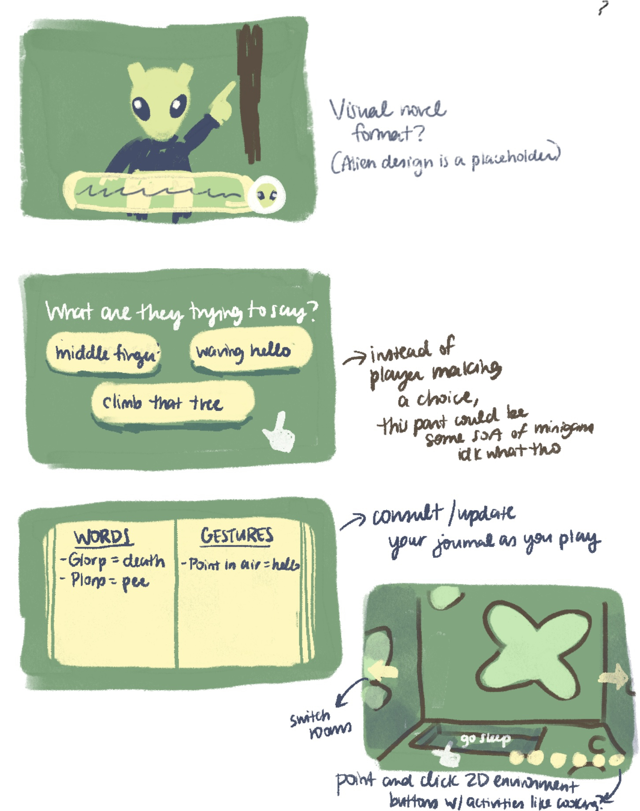

# Design Journal

## Iterative Prototype 2 ~ 12/03/25

 
I decided to go with my first idea that I'm for now calling CreepyCozy and figured that the first step would be making an explorable 3D environment, so that's what I focused on this week. I found [this video tutorial](https://www.youtube.com/watch?v=WbZpj8WcjN0) on creating a quick open world which I followed. Instead of using the assets in the video, I wanted to look for assets that would fit well in a horror game and found [these](https://assetstore.unity.com/packages/3d/environments/urban/pixel-horror-abandoned-rural-train-station-modular-218424#reviews). I like the simple low poly look and pixelated textures so I'll be using it for now for the sake of the prototype. Maybe in the next weeks I could make my own low poly assets in Blender to replace these.

I played around with color schemes for the environment (but I will likely change it in the future) and had fun adding fog. Originally, I wanted to make a simple scene for this week and thought of placing some of the elements in the asset pack to create my own abandoned train station in the woods. I was looking into how I could create a fenced off area in an easy way instead of manually placing the fence assets next to each other, and I found the polybrush tool and tried using it only to then figure out that it doesn't work on terrain womp womp. So unless I use the terrain tools, I'll probably just manually place the assets. I started doing that when I realized I didn't really know what I wanted my scene to look like, and had a hard time imagining it and where I wanted to place the assets. I probably could have just placed them anywhere just to play around, but I'd like to plan it out more if I want to later create exploration puzzles. So I thought of making simple sketches of the scene first, or maybe a map, before recreating it in Unity. Unfortunately I didn't have the time this week to do that, so it will have to be done for next time. Another small issue I had was that the tree assets were missing their textures and using another one that doesn't seem to be the one shown in the asset store. It's not a huge issue though, as long as the tree model is there to give the impression of a forest then it's fine.

ALSO another issue but that I will have to change later is that the assets came with an already made character controller, which as I was exploring the world I made, I found out that I can make my character fly by spamming the jump button, which I DON'T want. But I'll try to fix this later, especially since now it's kind of useful to be able to fly over my world to look over it quickly.

So my plan for next week is to make some sketches of the scenes I want to have that are explorable and recreate one of them while also thinking about puzzle ideas. And maybe I could then start making a simple interactible/grab-able items system that you could store in an inventory.

Story-wise, I thought maybe your character missed their train stop and ended up in a strange place. Maybe it could be an alternate universe. I figured one of the initial creepy elements could be ghost like characters that seem to stalk your character at first, and later on you find out they're friendly and want to help you back to your world (yes I was inspired by my 2nd idea).

## Iterative Prototype 1 ~ 06/03/25
Unfortunately I wasn't able to work on a playable game prototype during the reading week or this week, but I did a bit of ideating and some sketches based on ideas from our previous class. Last class, I was trying to come up with a way to merge cozy and horror together in a game, and one of the word combinations I thought of was relaxing + dark forests which led me to think about a deceptive game that feels like a horror game due to creepy environments and ambiance, but where there is no real threat, and as you keep playing you slowly begin to relax. I guess it's a game that is perfect for the anxious overthinkers because you start off expecting the worst and slowly relax over time and enjoy the game. Since you'd have to walk around and explore creepy environments, I thought of a walking simulator game but there could be puzzles hidden around the "map" that you need to solve to progress the story. I used a forest at night as an example but the setting could be something urban as well like an abandonned hospital or something. I did some simple sketches to see how I'd like the game to look UI wise and was asking myself if it would be better to have a seperate inventory screen that you access by pressing a certain button, or if it would be better to show all the UI elements on the same screen, which could work well if I don't plan on having the player collect too many items.
 

My second idea is based off of a word combination that came up last week when I was doing the game ideation exercise with Eric. The word combination we had was surreal + shame and we thought of the idea of being transported into a surreal, fever dream like world where the inhabitants speak a vastly different language and have their own customs and gestures. As you're now stuck in that world you'd have to do your best to communicate with the inhabitants and live. I expanded on the idea a bit and thought of a visual novel / life sim type game where you're somehow transported to another planet and have to co-exist with some friendly aliens. I though of it being a befriending simulator (as opposed to a dating simulator), where there are reoccuring characters that appear and speak to you in a language you don't understand. The friendly aliens provide you with a space to live and a job or something and you go through multiple social interactions that depending on your interpretation could either go well or wrong. You could also become closer to some of the regular beings you encounter and become friends as you start to understand them. For the how of understanding their language, I'm not sure if I should leave it as a choice for the player, which I feel makes more sense, or make it into a sort of minigame where if you succeed your character manages to understand what is being conveyed to them. The minigame could add a level of fun to the game but could also be frustrating cause how a player performs in the game affects their interactions. As you play the game, you take notes of what you learn as reference for the future. I feel like this idea is fun and I considered it being related to difficulties that some people (including myself) have with communication and connection with others. However, it is an ambitious idea with lots that needs figuring out, so I'm not sure if I'll keep going with this idea but it could be fun to explore it a bit.
 

## Breaking Out 2 ~ 20/02/25
First thing I wanted to do this week was change the controls of the paddle so that it's controlled by the mouse's X position. I also made it that you click to start the game instead of pressing space. After that, I got caught into small details like changing the sizes of the bricks, paddle and ball. I first wanted to make the bricks smaller so they could fit into the squares in the background, then I thought the paddle was too big for the size of the screen so I adjusted that, and then I had the same thought for the ball as well. So everything got tweaked in the end, but I think it looks better. I especially wasted lots of time trying to fit the bricks into the squares of the background image by playing around with the spacing between the bricks (though there is probably a better way to do it?). It took some time experimenting with that, and in the end I settled for what I got because it still looked cool. Unfortunately I didn't have the time to make a little bit of "pixel art" with the bricks like I mentioned last week. I did also try adding a game over screen. The computational part seems to work but for some reason the actual screen is not appearing. I think it has something to do with the fact that the canvas is off screen and I don't know how to move it on screen ANNND then I ran out of time to work on it some more. D: Other little detail I did was add a death sound and a sound for breaking the bricks! The sound for the bricks breaking just ended up being a higher pitched version of the blip because the other sound I found online sounded weird in the end so I changed it. I feel like with the small visual changes I've done this week that the game looks and feels more like it could be a mobile game. I have to admit I always feel a bit disappointed by the amount of work I get done each week. I know they're meant to be prototypes, but I wish I could spend more time experimenting, but just that often takes lots of time, especially since I'm new to Unity and C#. Oh and I forgot to mention, that I inspired myself from [this youtube tutorial series](https://www.youtube.com/playlist?list=PLElhtYsGq0haMcAYcCPM-AGglUmKUkO5B) for some of the features like moving the paddle with the mouse and the game over screen.
 

## Breaking Out ~ 13/02/25
For this week, I wanted to try making a look and feel prototype. I was inspired by the work I saw from my peers last week and wanted to try having a neon retro sort of look. I looked up a tutorial on Youtube to achieve the glow and made a simple background image. The idea I had was making the bricks be squares like pixels and then for next week, adding levels where the bricks make some sort of simple pixel art. Also as I'm typing this I just had the idea to make this game about pimple popping cause the title sort of sounds like an acne breakout. That would have been funny to explore but oh well I got that idea too late. I also thought of switching the game screen to be vertical as that might put more distance between the paddle, ball and the bricks and I felt it made sense for a game that has a lot of..vertical action? I wanted to add more UI elements like finishing up the lives and scoring system that was already sort of started, adding more audio, background music and a start/game over screen, but I ran out of time. Since we have the option to build upon this prototype for next week's prototype, I'll try to get that done for next week! Overall, I like the way the game looks and it was fun experimenting with the look of the game. 
 

## Pawng ~ 06/02/25
Once again I didn't have much time to work on the prototype but at least I have something to show this time. :) I thought it might be interesting to have the paddle sizes change over time, maybe having your opponent's paddle become smaller when you score a point to give you an extra reward. The same being true that your opponent could score and make your paddle smaller. (Though the issue I see here could be that players with a head start on the score have a much easier time winning the entire game, but I didn't really care about game balance and fun this week, I just wanted to try stuff out). To be honest, I wasn't sure how to achieve this so I did a bit of researching online. I found a useful [Youtube video series](https://www.youtube.com/watch?v=DnBTmYXThOY&list=PLEl7CIZGv53xhngxJdS_GAaSXpXcN-hSP) where they make a fancy Pong in Unity. Though looking at it quickly, I wasn't able to find what I needed so I have to admit that I did resort to using ChatGPT, at least for the beginning (I hope that's okay). Then, I got the idea of giving the player who scores an even bigger advantage and making their paddle bigger when they score as well. I also incorporated this to make sure I really understood the code that ChatGPT gave me and use what I learned in a slighyly different way. Next, I wanted to use the Youtube videos I mentionned earlier to make an ending screen whenever a player gets a total of 5 points. I did a bit of coding for it, but the example in the video was a bit more complicated as they were returning to a main menu screen they had previously made, once a player won. I tried simplifying it by having some simple text appear on screen whenever a player won, but I was having issues with having the text show up so I kind of gave up, mostly due to lack of time. I also added a score noise. I swear I had a good score sound already on my PC but I couldn't find it so I opted for something goofy. The sound also plays at the beginning of the game for some reason and I wasn't able to figure out why. So that's pretty much what I accomplished this week. If I had more time, I would have finished the player winner stuff and incorporated some of the stuff from the Youtube videos like visual effects and UI improvements. Maybe added more color to the game too. Gameplay-wise I did wonder if it would be interesting to have some sort of power ups you can collect that are sort of like the ball object and you have to catch them to receive some sort of power up like improved speed. But also that sounds complicated to do so I don't even know if I could have made that happen.

## Collision ~ 20/01/25
In the end, this week I didn't have much time to work on a prototype, so I focused on experimenting and playing around with Unity and what we learned in class last week. I don't really have anything to show for it because I ran into issues. I wanted to try collision with the example that we coded in the Chapter 20 of IGDPAD (where we make a bunch of colorful cubes spawn over and over) but I wanted to try making it with circles instead, but I had issues recreating the spawner for some reason. What would happen was the circle would fall, but others wouldn't spawn. I probably should have just opened the book again at that chapter to review how it was done but I wanted to try it myself to see if I can remember how to do it (clearly not). I though it would have been interesting to have a bunch of circle spawn and collide with each other as they filled out a closed space (like a rectangle). Though like I said earlier, due to lack of time, in the end I mostly did some explorations and experiments within Unity. If I had more time, maybe I would have played around different shapes and spawn rates.

## Tiny Game ~ 23/01/25 

[Project for class today](Projects/Week1/chrysalis.html)

After trying out the Bitsy games that were linked in the class website, I was impressed by the tool so I wanted to give it a try for this week’s game. I came up with two core mechanics I thought would be interesting to explore.

1- Telling a story through simple repetitive motions of the avatar, sort of like [this game](https://npckc.itch.io/you-are-dough) where you simply move the dough along as it gets turned into bread and get little bits of dialogue that progress the game. I thought of telling a story by having players control the movements of the sun and moon and thus controlling the flow of time. I was also inspired by the game Faith and a personal experience of looping nightmares, and so I thought of maybe making a small pixel horror game with an unending nightmare loop. I didn’t go through with this idea in the end because of the two ideas I had, this seemed the hardest to pull off with Bitsy (especially visually as I imagined it in a similar style to that of Faith’s).

2- Exploring your environment and surroundings and making sense of it. Each room of the game is like a puzzle piece where you must explore all the rooms to make sense of where you are and figure out the shape of the world. I imagined playing the game in the perspective of an insect so that it could be on smaller, more recognizable (to us at least) objects like flowers, leafs, etc. 

<!--  -->
<!-- [this is a link](https://www...) -->

Like I mentioned before, I went with the second idea for this prototype because it seemed more achievable. I decided on having players control an anxious, shut-in caterpillar as it explores the big world after being forced out of its home (a leaf) after eating it all. Players explore each room of every level (which are separated by different color palettes) to make sense of the environment they’re in. Pieces of caterpillar food are scattered along the rooms to to progress the dialogue/story, but also to guide the player towards certain directions. Once they reach the last room, they are asked what it is they’ve been exploring thus far. Once they make the right decision, they move onto the next level.

I made this in a few hours, but if I had more time for it, I would have improved the visuals and the puzzles (as in, make more rooms for each level and more complex levels). Originally, I thought it would be visually interesting if the smaller tiles of the game formed a bigger visual together, not just for the big “puzzle” pieces of the environment, but for background elements as well. As seen in my sketches, for example in the flower level, I wanted to have other flowers visible in the background. So if I were to improve on this later, I would add more interesting visuals. I maybe would have played around more with Bitsy’s sound tools to make a little song. While I enjoyed using this tool to make my tiny game, it was also frustrating because it would visually bug often and I’d have to refresh my page a lot, so I didn’t feel like making anything too long and complicated (which I guess is fine cause the point was to make a tiny game/prototype).

After doing the class playtest, most people seemed to enjoy the theme and found the game cute and enjoyed the concept of figuring out what your environment is. Like I expected, because there is only one tile for each exit in Bitsy, it led to confusion on which specific tile in the map leads to the next room.

